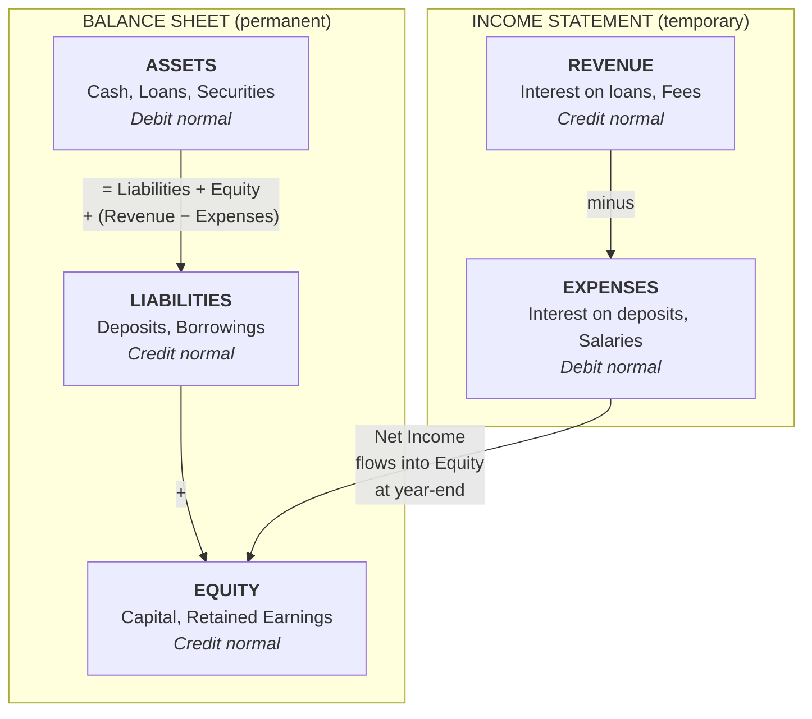

# In-Memory Core Banking System

A simplified but functionally complete Go library modeling the core accounting engine of a bank. Intended as a reference implementation for learning and prototyping — not for production use (which would require persistent storage, distributed transactions, etc.).

## Three-Layer Architecture

The system is split into three layers, each in its own package and building on the one below it:

1. **`ledger` — the general ledger.** The pure, double-entry accounting core: ledgers, subledgers, accounts, multi-legged transactions, postings, and on-demand book balances. Its top-level type is `ledger.Book`. It knows nothing about customers' account status, holds, available balance, or snapshots.

2. **`deposit` — the demand-deposit (DDA) layer.** Layered on top of a `ledger.Book`, this is the customer-facing checking/current-account layer. Its top-level type is `deposit.Register`. It adds account **status and lifecycle**, **overdraft limits**, authorization **holds** and the **available balance** they reduce, and end-of-day **snapshots**. Each deposit account wraps a backing Liability GL account; the deposit layer never stores money itself — every movement of value is a real posting in the underlying `ledger.Book`.

3. **`payment` — the interbank payment network.** Each participant bank gets its own `ledger.Book` plus a `deposit.Register` over it; funds and status checks for a payment run through that deposit layer, while the multi-leg GL postings (debtor leg, creditor leg, reserve movements) live in the payment layer. Its top-level type is `payment.Network`.

The sections below are organized around these layers: general-ledger concepts first, then the deposit-layer concepts (holds, available balance, account lifecycle, snapshots), then the payment network.

## Table of Contents

- [Core Banking Concepts](#core-banking-concepts)
- [Accounting Foundations](#accounting-foundations)
  - [Double-Entry Bookkeeping](#double-entry-bookkeeping)
  - [Chart of Accounts](#chart-of-accounts)
    - [Asset](#asset--things-the-bank-owns-or-is-owed)
    - [Liability](#liability--things-the-bank-owes-to-others)
    - [Equity](#equity--the-owners-residual-interest)
    - [Revenue](#revenue--income-the-bank-earns)
    - [Expense](#expense--costs-the-bank-incurs)
  - [Ledger and Subledger Hierarchy](#ledger-and-subledger-hierarchy)
  - [Amounts and Precision](#amounts-and-precision)
- [Transactions](#transactions)
  - [Entries, Legs, and Postings](#entries-legs-and-postings)
  - [Booking Date vs. Value Date](#booking-date-vs-value-date)
  - [Balance Types](#balance-types)
  - [Multi-Legged Transactions](#multi-legged-transactions)
  - [Holds (Authorization / Pending Transactions)](#holds-authorization--pending-transactions)
  - [Idempotency](#idempotency)
  - [Transaction Reversal](#transaction-reversal)
- [Account Lifecycle](#account-lifecycle)
  - [Account States](#account-states)
  - [State Transitions](#state-transitions)
  - [Overdraft](#overdraft)
- [Settlement Cycles](#settlement-cycles)
  - [What Is Settlement](#what-is-settlement)
  - [Common Settlement Cycles](#common-settlement-cycles)
  - [Settlement and the Ledger](#settlement-and-the-ledger)
- [Payments, Clearing, and Settlement (the `payment` package)](#payments-clearing-and-settlement-the-payment-package)
  - [Why a Separate Package](#why-a-separate-package)
  - [The Multi-Bank Model](#the-multi-bank-model)
  - [Payment Schemes](#payment-schemes)
  - [The Payment Lifecycle](#the-payment-lifecycle)
  - [Posting Choreography: SEPA Credit Transfer](#posting-choreography-sepa-credit-transfer)
  - [Netting: A Worked Example](#netting-a-worked-example)
  - [SEPA Direct Debit and Returns](#sepa-direct-debit-and-returns)
  - [Deliberate Simplifications](#deliberate-simplifications)
  - [Next Work](#next-work)
- [Reporting and Compliance](#reporting-and-compliance)
  - [End-of-Day Snapshots](#end-of-day-snapshots)
- [Statements](#statements)
  - [Derived from the Ledger, Not a Separate Account Ledger](#derived-from-the-ledger-not-a-separate-account-ledger)
  - [What Appears on a Statement](#what-appears-on-a-statement)
  - [Why Transactions and Balances May Not Reconcile](#why-transactions-and-balances-may-not-reconcile)
- [Usage Example](#usage-example)

## Core Banking Concepts

A core banking system is the backbone of a financial institution. It is the "system of record" for all financial activity — every deposit, withdrawal, transfer, loan disbursement, and fee charge flows through it. The concepts below explain how this system models real-world banking.

## Accounting Foundations

### Double-Entry Bookkeeping

The most fundamental principle in banking is double-entry bookkeeping, invented in 15th century Italy and still the foundation of all modern accounting. The rule is simple:

> Every transaction must have equal debits and credits.

This means money never appears or disappears — it always moves from one account to another. When a customer deposits $100 cash:

- **Debit:** Bank's Cash account (asset increases — the bank has more cash)
- **Credit:** Customer's Deposit account (liability increases — the bank owes the customer more)

When a customer transfers $50 to another customer:

- **Debit:** Sender's Deposit account (liability decreases)
- **Credit:** Receiver's Deposit account (liability increases)

The balanced nature of double-entry provides a built-in error-detection mechanism: if debits don't equal credits, something is wrong.

### Chart of Accounts

The chart of accounts organizes all accounts into five fundamental types, derived from the accounting equation:

```
Assets = Liabilities + Equity + (Revenue - Expenses)
```

The five types split into two groups: three permanent accounts on the **balance sheet** (a snapshot of the bank's financial position at a point in time) and two temporary accounts on the **income statement** (activity over a period). At year-end, net income flows into equity, connecting the two:



Each type has a "normal balance" — the direction that increases it:

| Type | Normal Balance | Description | Examples |
|------|---------------|-------------|----------|
| **Asset** | Debit | Things the bank owns or is owed | Cash, loans to customers, securities, real estate |
| **Liability** | Credit | Things the bank owes to others | Customer deposits, borrowings, bonds payable |
| **Equity** | Credit | Owner's residual interest | Paid-in capital, retained earnings |
| **Revenue** | Credit | Income earned | Interest income, fee income, trading gains |
| **Expense** | Debit | Costs incurred | Interest expense, salaries, rent, provisions |

#### Asset — Things the Bank Owns or Is Owed

An asset is anything of value that the bank controls. The most intuitive example is cash sitting in the vault — that is clearly something the bank owns. But assets also include money that other people owe *to* the bank. When a bank gives a customer a $200,000 mortgage, the bank doesn't lose $200,000 — it *converts* one asset (cash) into another asset (a loan receivable). The customer now owes the bank $200,000 plus interest, and that obligation is valuable.

Common asset accounts in a bank:
- **Cash / reserves** — physical currency and balances held at the central bank
- **Loans to customers** — mortgages, personal loans, credit card balances
- **Securities** — government bonds, corporate bonds, and other investments the bank holds
- **Interbank lending** — short-term loans to other banks (e.g., overnight lending)

Assets have a **debit normal balance**, meaning a debit increases an asset and a credit decreases it. When the bank receives a $500 cash deposit from a customer, its cash (asset) increases by a $500 debit — but as we'll see, the other side of that entry is a liability.

#### Liability — Things the Bank Owes to Others

A liability is an obligation the bank has to pay someone else. The most important liability for a bank is **customer deposits**. When a customer deposits $500 into their checking account, the bank now *owes* that customer $500 on demand. The customer's account balance is, from the bank's perspective, a debt.

This is often the most counterintuitive part: the money in your checking account is the bank's liability, not its asset. The bank has the cash (asset), but it owes that cash back to you (liability).

Common liability accounts in a bank:
- **Customer deposits** — checking accounts, savings accounts, certificates of deposit
- **Borrowings** — money the bank has borrowed from other banks or the central bank
- **Bonds payable** — debt securities the bank has issued to raise capital

Liabilities have a **credit normal balance**. A credit increases a liability and a debit decreases it. When a customer deposits $500, the bank credits the customer's deposit account (liability goes up) and debits its cash account (asset goes up). Both sides increase — the bank has more cash *and* owes more to the customer.

#### Equity — The Owner's Residual Interest

Equity is what's left over after you subtract liabilities from assets. It represents the shareholders' stake in the bank. If a bank has $100M in assets and $92M in liabilities, the equity is $8M.

Equity accounts don't change as frequently as the others. They mainly move when the bank issues new shares, buys back shares, or at year-end when net profit (revenue minus expenses) is rolled into retained earnings.

Common equity accounts:
- **Paid-in capital** — money shareholders invested when buying the bank's stock
- **Retained earnings** — accumulated profits the bank has kept rather than distributing as dividends

Equity has a **credit normal balance**. Profits increase equity (credit), losses decrease it (debit).

#### Revenue — Income the Bank Earns

Revenue accounts track money flowing into the business from its operations. For a bank, the primary source of revenue is interest charged on loans — the bank lends money at a higher rate than it pays on deposits, and the difference (the *net interest margin*) is how banks make most of their money.

Common revenue accounts:
- **Interest income** — interest earned on loans, mortgages, and securities
- **Fee income** — account maintenance fees, ATM fees, wire transfer fees, overdraft fees
- **Trading gains** — profits from buying and selling securities

Revenue has a **credit normal balance**. When a customer pays $50 in monthly interest on a loan, the bank credits interest income (revenue goes up) and debits the customer's loan account (the loan balance — an asset — decreases because the customer has repaid part of it) or debits cash (if the payment comes from outside the bank).

At year-end, revenue accounts are "closed" — their balances are zeroed out and the net profit is transferred into retained earnings (equity).

#### Expense — Costs the Bank Incurs

Expense accounts track the costs of running the bank. Just as revenue increases the owners' stake, expenses decrease it.

Common expense accounts:
- **Interest expense** — interest paid to depositors and bondholders (this is the bank's biggest cost)
- **Salaries and benefits** — compensation for employees
- **Provisions for loan losses** — money set aside in case borrowers default
- **Operating costs** — rent, technology, compliance, legal

Expenses have a **debit normal balance**. When the bank pays $10 in monthly interest to a savings account customer, it debits interest expense (expense goes up) and credits the customer's deposit account (liability goes up — the bank now owes the customer $10 more).

Like revenue, expense accounts are closed at year-end into retained earnings.

### Ledger and Subledger Hierarchy

Accounts are organized into a two-level hierarchy:

```
General Ledger
├── Customer Deposits (subledger)
│   ├── Alice Checking (Liability)
│   ├── Bob Checking (Liability)
│   └── ... 50,000 more accounts
├── Loans (subledger)
│   ├── Loan #12345 (Asset)
│   └── ...
├── Bank Assets (subledger)
│   └── Cash Vault (Asset)
└── Revenue (subledger)
    └── Fee Income (Revenue)
```

- **Ledger:** The top-level book. A bank typically has a General Ledger (GL) that contains all accounts. Large banks may also have separate ledgers for different business units or legal entities.

- **Subledger:** A subdivision of a ledger that groups related accounts. For example, under the General Ledger you might have subledgers for "Customer Deposits", "Loans", "Interbank", "Fee Income", etc. Subledgers allow the GL to show summary totals while the subledger contains the individual account detail.

In practice, the General Ledger might show one line item for "Total Customer Deposits" ($10M), while the Customer Deposits subledger contains 50,000 individual customer accounts that sum to that total.

### Amounts and Precision

All monetary amounts are represented as integer values in the smallest unit of the currency (e.g., cents for USD). This is the same approach used by Stripe, most banks, and payment processors.

This avoids floating-point precision issues entirely. For example:

| Display | Internal | Unit |
|---------|----------|------|
| $100.50 | 10050 | cents |
| $1,234.56 | 123456 | cents |
| $10,000.00 | 1000000 | cents |

The caller is responsible for converting to/from display format.

## Transactions

### Entries, Legs, and Postings

A few words are used interchangeably throughout this document and the code, so it is worth pinning them down up front:

- **Entry:** A single debit or credit to one account. This is the `ledger.Entry` type — it carries an account, an amount, and a `Direction` (`Debit` or `Credit`). It is the smallest unit of bookkeeping.

- **Leg:** A synonym for *entry*. The word is used when emphasizing that a transaction has several sides — a "two-legged" transfer has one debit entry and one credit entry, while a "multi-legged" transaction has three or more. "Leg" and "entry" refer to exactly the same thing; there is no separate `Leg` type.

- **Posting:** The act of recording a transaction in the ledger (the verb, as in "to post a transaction" via `PostTransaction`). Loosely, "a posting" is also used to mean an entry that has been recorded. Posted transactions are immutable — they are never edited or deleted, only reversed (see [Transaction Reversal](#transaction-reversal)).

- **Transaction:** A balanced set of entries (legs) that are posted together as one atomic unit. Within any transaction, **total debits = total credits** (see [Multi-Legged Transactions](#multi-legged-transactions)).

In the `payment` layer two specific legs get their own names: the **debtor leg** is the entry that moves money out of the payer's account (posted at initiation), and the **creditor leg** is the entry that delivers money into the payee's account (posted at settlement). Both are ordinary ledger entries — the names just identify which side of a cross-bank payment they represent. See [The Payment Lifecycle](#the-payment-lifecycle).

> **Trial balance:** Referenced in a few places below, this is the list of every account's balance at a point in time. Because every transaction balances, the sum of all debit balances must equal the sum of all credit balances — a trial balance that does not sum to zero signals a bookkeeping error.

### Booking Date vs. Value Date

Every transaction carries two dates:

- **Booking Date:** The date/time when the transaction was recorded in the system. This is the "system date" or "processing date". It determines when the transaction appears in system reports.

- **Value Date:** The date when the transaction takes economic effect. This determines when interest starts accruing, when funds become available, and which business day "owns" the transaction. The value date may be in the past (back-dated) or future (forward-dated) relative to the booking date.

#### When Value Date Differs from Booking Date

In many real-world scenarios the two dates can diverge by days or even weeks:

- **Weekend/holiday processing:** A wire transfer received Friday evening is booked immediately (Booking Date: Friday 7:00 PM) but funds are only available on the next business day (Value Date: Monday). Over a long holiday weekend this gap can stretch to 4–5 days.

- **Check deposits:** A customer deposits a check on Monday and the bank records it right away (Booking Date: Monday). However, the check must clear through the interbank settlement network, so the value date might be Wednesday or Thursday depending on the clearing cycle. Until then the funds don't accrue interest and may not be available for withdrawal.

- **Back-dated corrections:** An operations team discovers on March 5 that a corporate payment should have settled on February 28. The correction is booked today (Booking Date: March 5) but given a value date of February 28 so that interest calculations for the intervening days are correct. Without this, the customer would lose several days of interest.

- **Forward-dated standing orders:** A customer schedules a rent payment for the 1st of next month. The bank may book the instruction today (Booking Date: January 20) but assign a value date of February 1, when the money actually moves and interest implications begin.

- **Securities settlement:** A stock trade executed on Monday (trade date T) typically settles on the next business day (T+1). The cash leg is booked on Monday but value-dated to Tuesday when ownership and funds actually transfer.

Interest is calculated based on value dates, not booking dates. This distinction is critical for accurate financial calculations — using the wrong date can mean customers earn too much or too little interest, and regulatory balance reports would be incorrect.

#### Who Decides the Value Date

The value date is not set by a single actor — it depends on the transaction type:

- **Automated rules** handle the majority of cases. The bank's system assigns the value date based on predefined policies per product and payment channel (e.g., domestic wires get same-day value, checks get T+2, international transfers get T+1 to T+3 depending on the corridor).

- **Payment networks** can dictate it. SWIFT messages for international transfers include a value date field set by the sending bank that the receiving bank is expected to honor. Securities settlement follows market conventions like T+2 that both parties agree to.

- **The customer** influences it for scheduled payments and standing orders — they choose when the payment should take effect, which becomes the value date.

- **Operations staff** set it manually for corrections and adjustments, deciding the appropriate value date based on when the economic event actually occurred or should have occurred.

- **Regulation** constrains all of the above. Laws like the US Expedited Funds Availability Act (Reg CC) set maximum hold periods for check deposits, putting an upper bound on how far the value date can lag behind the booking date.

In practice, most core banking systems have a rules engine upstream of the ledger that determines the value date automatically before posting the transaction.

### Balance Types

A single account carries three distinct balances at any point in time:

- **Value-date balance** (also called the **interest-bearing balance**): The balance computed from transactions whose value date has passed. This is what the bank uses to calculate interest, generate end-of-day snapshots, and produce regulatory reports. It represents the economic reality of the account.

- **Book balance** (also called the **ledger balance**): The balance computed from all posted transactions based on their booking date, regardless of value date. It reflects everything that has been recorded in the system.

- **Available balance**: The book balance minus any active holds. This is what ATMs and point-of-sale terminals check to decide whether a transaction should be approved.

For example, a single account might show all three balances simultaneously:

| Balance | Amount | What drives it |
|---------|--------|----------------|
| Value-date balance | $9,500 | Only transactions whose value date has passed |
| Book balance | $10,000 | All posted transactions |
| Available balance | $9,200 | Book balance minus $800 in active holds |

The value-date balance can be lower than the book balance if a forward-dated transaction has been booked but its value date has not yet arrived. It can be higher if a back-dated correction added economic value to a past date.

### Multi-Legged Transactions

While simple transfers involve two entries (one debit, one credit), real-world transactions often require more legs:

- **Fee split:** A $100 payment might be split into $97 to the merchant and $3 to the fee income account.

- **Loan disbursement:** Disbursing a $10,000 loan might involve crediting the customer's deposit account, debiting the loan receivable account, and debiting an origination fee from the deposit account with a corresponding credit to fee revenue.

- **Interest accrual:** Posting monthly interest on a savings account involves debiting the bank's interest expense account and crediting the customer's deposit account, possibly with a separate leg for tax withholding going to a liability account.

In all cases, the invariant holds: **total debits = total credits**.

### Holds (Authorization / Pending Transactions)

> Holds, the available balance, account status, and snapshots all live in the **`deposit`** package (`deposit.Register`), not in the general ledger. The pure `ledger.Book` only knows about posted transactions and book balances. This section describes deposit-layer behavior.

Holds model the "auth-capture" flow common in card payments and other scenarios where funds must be reserved before a final amount is known:

1. **Authorization:** When a customer swipes their debit card at a gas pump, the bank places a hold (e.g., $100) on the account. The book balance is unchanged, but the available balance drops by $100.

2. **Capture:** When the customer finishes pumping ($45 of gas), the hold is captured for the actual amount. The hold is removed and a real transaction is posted for $45.

3. **Release:** If the transaction is cancelled (e.g., the customer drives away without pumping), the hold is released and the available balance is restored.

The difference between book balance and available balance is significant. In the deposit layer a customer's money is the book balance of the backing Liability GL account, and the available balance accounts for both active holds and any overdraft limit:

```
Book Balance      = book balance of the backing GL account
Available Balance = Book Balance - Active Holds + Overdraft Limit
```

Holds typically have an expiration time. If not captured within that window, they automatically stop affecting the available balance.

#### Holds Are Off-Ledger

Unsettled holds do not exist as ledger entries. The general ledger only records posted transactions — actual debits and credits that have settled. A hold is an operational concept tracked by the `deposit` layer alone; it doesn't move money and doesn't appear in the general ledger or trial balance.

A hold only touches the ledger when it is **captured** — at that point `deposit.Register` posts a real transaction into the underlying `ledger.Book` with proper debits and credits (debiting the customer's Liability GL account, crediting the counterparty). If the hold is **released**, nothing ever hits the ledger; from an accounting perspective it's as if it never happened.

This is exactly why holds live one layer up from the ledger: the ledger stays a pure record of settled value, and the deposit layer owns the operational state. The ledger is only involved when a hold is captured and converted into a real transaction.

### Idempotency

In distributed systems, clients may retry requests due to timeouts or network failures. Without idempotency, a retry could cause the same transaction to be posted twice.

The idempotency key mechanism prevents this:

1. The client generates a unique key (e.g., a UUID) for each logical operation and includes it in the request.
2. If the system receives a request with a key it has already processed, it returns an error instead of creating a duplicate.
3. The client can then look up the original transaction by the key.

### Transaction Reversal

In banking, posted transactions are never deleted. The ledger is an immutable record. To correct an error, a new "reversal" transaction is posted that exactly offsets the original:

- Every debit in the original becomes a credit in the reversal.
- Every credit in the original becomes a debit in the reversal.
- The net effect on all accounts is zero.

The original transaction is marked as "Reversed" for reporting purposes, and the reversal transaction carries a reference to the original.

## Account Lifecycle

> Account status and its lifecycle are a **`deposit`**-package concern (`deposit.Account` and `deposit.Register`), not a general-ledger one. The `ledger.Book` does not track account status; a GL account simply exists. The `deposit.Register` adds the status machine (`Active`, `Dormant`, `Frozen`, `Closed`) and enforces the transitions below via `Freeze`, `Unfreeze`, `MarkDormant`, `Reactivate`, and `Close`.

In a real banking system, accounts are not simply created and then used forever. They go through a series of states that govern what operations are permitted.

### Account States

| State | Description | Allowed Operations |
|-------|-------------|-------------------|
| **Active** | Normal operating state. The account is open and fully functional. | All: debits, credits, holds, statements |
| **Dormant** | No customer-initiated activity for an extended period (typically 12–24 months, varies by jurisdiction). The bank may charge dormancy fees. | Credits only (incoming payments reactivate the account). Debits and new holds blocked until reactivated. |
| **Frozen** | Temporarily restricted, usually due to a court order, fraud investigation, or regulatory action. | View balance only. All debits, credits, and holds blocked. The freeze may be partial (e.g., allowing credits but blocking debits). |
| **Closed** | Permanently shut down. The account no longer accepts any transactions. | None. Balance must be zero before closing. Historical data retained for regulatory purposes. |

### State Transitions

```
                  ┌─────────────────────────────────┐
                  │                                 │
                  ▼                                 │
  ┌──────────┐  inactivity  ┌──────────┐  customer  │
  │  Active  │ ──────────▶  │ Dormant  │ ──request──┘
  │          │ ◀──────────  │          │
  └──────────┘  reactivate  └──────────┘
       │                         │
       │ freeze                  │ freeze
       ▼                         ▼
  ┌──────────┐              ┌──────────┐
  │  Frozen  │              │  Frozen  │
  └──────────┘              └──────────┘
       │                         │
       │ unfreeze                │ unfreeze
       ▼                         ▼
  ┌──────────┐              ┌──────────┐
  │  Active  │              │ Dormant  │
  └──────────┘              └──────────┘
       │
       │ close (balance = 0)
       ▼
  ┌──────────┐
  │  Closed  │  (terminal state)
  └──────────┘
```

Key rules:

- **Active → Dormant:** Triggered automatically after a configurable inactivity period. The bank must typically notify the customer before the transition.
- **Dormant → Active:** Any customer-initiated transaction or explicit reactivation request returns the account to Active.
- **Any → Frozen:** Can happen at any time due to legal or fraud reasons. The previous state is preserved so the account returns to it when unfrozen.
- **Active → Closed:** Only permitted when the balance is zero. Requires all pending holds to be resolved and all scheduled payments to be cancelled.
- **Closed is terminal:** A closed account cannot be reopened. If the customer wants to bank again, a new account must be created.

### Overdraft

An overdraft occurs when a transaction would cause an account's available balance to go below zero. Banks handle this in several ways:

- **Hard decline:** The transaction is rejected outright. This is the simplest model and is what this implementation uses for Asset and Expense accounts — the system returns `ErrInsufficientBalance` if a debit would push the available balance negative.

- **Arranged overdraft (credit facility):** The customer has a pre-agreed overdraft limit. Transactions are permitted as long as the negative balance does not exceed this limit. For example, an account with a $0 balance and a $500 overdraft limit can process debits up to $500. Interest is typically charged on the overdrawn amount at a higher rate than standard lending.

- **Unarranged overdraft:** The bank may choose to honor a transaction that exceeds the arranged limit (or where no arrangement exists) as a courtesy, but at significantly higher fees. Regulations in many jurisdictions cap these fees.

From a ledger perspective, overdraft is straightforward: the book balance of a liability account goes negative (from the bank's perspective, the customer now owes the bank rather than the bank owing the customer). The overdraft limit is a business rule enforced *before* posting to the ledger — the ledger itself is simply recording the economic reality.

```
Account balance:        $200   (bank owes customer $200)
Overdraft limit:        $500
Transaction:           -$600   (debit of $600)
New balance:           -$400   (customer owes bank $400)
Available for further: $100    (limit $500, used $400)
```

The available balance calculation with overdraft becomes:

```
Available Balance = Book Balance + Overdraft Limit - Active Holds
```

## Settlement Cycles

### What Is Settlement

Settlement is the process by which a transaction becomes final and irrevocable — when ownership of funds actually transfers between parties. The distinction between *executing* a transaction and *settling* it is fundamental to banking.

When Alice sends Bob $100 via bank transfer, several things happen in sequence:

1. **Initiation:** Alice's bank debits her account and sends a payment instruction.
2. **Clearing:** The payment networks validate, match, and route the instruction. Net positions between banks are calculated.
3. **Settlement:** The actual movement of funds between banks occurs, typically through central bank accounts. The transaction is now final.

The time between initiation and settlement is the **settlement cycle**.

### Common Settlement Cycles

| Payment Type | Typical Cycle | Details |
|-------------|--------------|---------|
| **Card payments** | T+1 to T+2 | The merchant's bank receives funds 1–2 business days after the transaction. The cardholder sees an immediate hold, then a posted transaction after settlement. |
| **ACH / Direct Debit** | T+1 to T+2 | Batched and settled through the Automated Clearing House. Same-day ACH is available but not universal. |
| **Wire transfers (domestic)** | T+0 (same day) | Settled in real-time or near-real-time through systems like Fedwire (US) or CHAPS (UK). Irrevocable once sent. |
| **Wire transfers (international)** | T+1 to T+3 | Routed through correspondent banks via SWIFT. Each intermediary adds latency. |
| **Check deposits** | T+1 to T+5 | Varies significantly. Reg CC (US) sets maximum hold periods. The bank may grant provisional credit before final settlement. |
| **Securities (stocks, bonds)** | T+1 | Most equity markets settled T+2 historically but moved to T+1 in 2024. |
| **Real-time payments** | Instant | Systems like FedNow (US), Faster Payments (UK), and SEPA Instant (EU) settle in seconds, 24/7. |

### Settlement and the Ledger

Settlement cycles directly affect the booking date vs. value date distinction described earlier:

- **Booking date** is typically when the bank initiates or receives the payment instruction.
- **Value date** is when settlement occurs and funds become economically available.

During the settlement window, the transaction exists in a **pending** state. The bank has recorded the intent (booking) but the funds have not yet moved (settlement). This gap creates several practical considerations:

- **Interest accrual** starts on the value date, not the booking date. A check deposited on Friday does not earn interest over the weekend if the value date is Monday.

- **Counterparty risk** exists during the settlement window. If the sending bank fails between initiation and settlement, the funds may not arrive. This is why settlement finality matters — it marks the point at which the transaction can no longer be unwound.

- **Holds bridge the gap** between initiation and settlement. When a customer deposits a check, the bank may place a hold that expires once settlement is confirmed, preventing the customer from spending funds that have not yet arrived.

- **Reconciliation** of nostro/vostro accounts (the accounts banks maintain with each other) happens as part of the settlement process. Discrepancies between expected and actual settlements must be investigated and resolved.

## Payments, Clearing, and Settlement (the `payment` package)

The `ledger` package described above is a single bank's book of record. But a *payment* — sending money from one person's account to another's — usually crosses a boundary between two banks, and that is where clearing and settlement live. The `payment` package builds that world on top of the ledger so the mechanics are concrete and testable.

### Why a Separate Package

A payment system is not the same thing as a general ledger. The ledger answers "what does this bank owe and own?"; the payment system answers "how does money actually move between banks?". Keeping them in separate packages mirrors how real institutions are organised — the payment rails (SEPA, card networks, RTGS) sit *above* each bank's accounting system and instruct it. The `payment` package depends on `ledger` and orchestrates postings into it; the ledger has no knowledge of payments.

### The Multi-Bank Model

The key design choice is that **each participant bank keeps its own `ledger.Book`** (with a `deposit.Register` over it for its customer accounts), and there is **one more `ledger.Book` for the central bank**. Banks never write into each other's books — they only meet at the central bank, where each holds a **reserve account**. This is what makes the difference between clearing and settlement real rather than abstract:

- **Clearing** is the exchange and *netting* of payment instructions. The banks agree on who owes whom. No central-bank money moves.
- **Settlement** is the movement of reserves between banks at the central bank. This is the moment of *finality*.

Each participant's chart of accounts holds:

| Account | Type | Purpose |
|---|---|---|
| Customer deposits | Liability | What the bank owes each customer. |
| Clearing Suspense | Liability | In-transit funds that have left a customer but not yet settled between banks. Returns to zero once a cycle settles. |
| Reserve at Central Bank | Asset | The bank's claim on the central bank. Moves only at settlement and **mirrors** the bank's reserve account in the central-bank ledger (the classic nostro/vostro reconciliation). |

The central-bank ledger holds one **Reserve: \<Bank\>** liability account per participant (the central bank owes each member its reserves) plus a balancing **Settlement Assets** account used when reserves are funded.

### Payment Schemes

Different payment products behave differently, so the package abstracts them behind a `Scheme` interface:

```go
type Scheme interface {
    ID() SchemeID
    Direction() SchemeDirection      // Push (payer initiates) | Pull (payee initiates)
    SettlementModel() SettlementModel // Net (batched) | Gross (instant, per-payment)
    RequiresMandate() bool
    AllowsReturn() bool
    SettlementDelay() time.Duration   // determines the value date
    Validate(p *Payment, ctx SchemeContext) error
}
```

Two schemes ship today, both net-settled:

- **SEPA Credit Transfer (`SCT`)** — a **push** payment: the payer's bank initiates and sends the funds (T+1). Maps to the ISO 20022 `pacs.008` message.
- **SEPA Direct Debit (`SDD`)** — a **pull** payment: the payee's bank collects funds from the payer under a previously signed **mandate** (T+2), and the payer may demand a **return**. Maps to `pacs.003`.

Crucially, money always flows **debtor → creditor** regardless of who *initiates* — `Direction` only governs initiation and whether a mandate is required. This is why the same posting machinery serves both schemes. Other **net-settled** schemes drop in by implementing `Scheme` and registering it — the orchestrator does not change. **Instant** and **card** schemes need a little more wiring; see [Next Work](#next-work).

### The Payment Lifecycle

Every payment travels through an explicit state machine:

```
Initiated ──▶ Accepted ──▶ Cleared ──▶ Settled
                  │                        │
                  ▼                        ▼
              Rejected                  Returned
```

- **Initiated → Accepted**: the scheme validates the payment (funds available, mandate valid) and the **debtor leg** is posted — the payer's money leaves their account into the bank's clearing suspense, value-dated to the settlement date.
- **Accepted → Cleared**: the clearing cycle reaches its cut-off and net positions are computed.
- **Cleared → Settled**: reserves move at the central bank and the **creditor leg** is posted, paying the payee.
- **Rejected**: before clearing, the debtor leg is reversed.
- **Returned**: after settlement, a SEPA R-transaction unwinds the flow.

### Posting Choreography: SEPA Credit Transfer

Alice (at Bank A) pays Bob (at Bank B) €30.00 (`3000` cents).

**1. Initiation** — in Bank A's ledger, value-dated to settlement:

```
Bank A:  Debit  Alice (Liability)            3000     // Alice's deposit falls
         Credit Clearing Suspense (Liability) 3000    // Bank A now owes the network
```

**2. Clearing (cut-off)** — net positions computed; no money moves. Here `net[A] = -3000`, `net[B] = +3000`.

**3. Settlement** — three postings make the money final:

```
Central Bank:  Debit  Reserve: Bank A (Liability) 3000   // A's reserves fall
               Credit Reserve: Bank B (Liability) 3000   // B's reserves rise

Bank A:        Debit  Clearing Suspense 3000             // suspense clears to zero
               Credit Reserve at CB     3000             // A's reserve asset falls in step

Bank B:        Debit  Clearing Suspense 3000             // creditor leg: release...
               Credit Bob (Liability)   3000             // ...funds to Bob
               Debit  Reserve at CB     3000             // B's reserve asset rises
               Credit Clearing Suspense 3000             // and its suspense clears
```

Afterwards both banks' suspense accounts are back to zero, and each bank's **Reserve at Central Bank** asset equals the central bank's **Reserve: \<Bank\>** liability — the books reconcile.

### Netting: A Worked Example

Netting is the whole point of clearing. Suppose in one cycle:

- Alice (Bank A) → Bob (Bank B): `30000`
- Bob (Bank B) → Alice (Bank A): `10000`

The **customers** move by the gross amounts (Alice −30000 +10000, Bob −10000 +30000), but the **banks settle only the net**:

```
net[A] = -30000 + 10000 = -20000   // Bank A pays 20000 net
net[B] = +30000 - 10000 = +20000   // Bank B receives 20000 net
```

Only `20000` of central-bank reserves moves, not `40000`. Net positions always sum to zero, which is exactly why the central-bank settlement transaction balances.

### SEPA Direct Debit and Returns

A direct debit is a **pull**: the creditor (e.g. a utility) collects from the debtor. Before any collection, the debtor signs a **mandate** authorising that specific creditor. At initiation the package checks the mandate exists, is active, matches both parties, and stays within its amount limit — otherwise the payment is rejected (`ErrMandateRequired`, `ErrMandateRevoked`, `ErrMandateExceeded`, …). Mechanically the postings are identical to a credit transfer (debtor → creditor), because the money flows the same way.

Direct debits can be **returned** (a SEPA R-transaction) — for example when the debtor disputes the collection or lacks funds. `ReturnPayment` posts compensating transactions that move the funds back from the creditor to the debtor across the central bank, fully unwinding the original flow and restoring both customers' balances.

### Deliberate Simplifications

This is a learning model, not a production processor. The simplifications are intentional:

- **No ISO 20022 message parsing.** The `Payment` struct stands in for `pain.001`/`pacs.008`/`pacs.003`; the schemes only *name* the messages they correspond to.
- **No IBAN or BIC validation.** Routing is by explicit `ParticipantID`; IBANs are free-form labels.
- **A single currency**, using `ledger.Amount` (integer minor units). No FX.
- **Cross-ledger postings are not atomic.** Each bank and the central bank have separate locks, so a payment touches several ledgers sequentially. The `Network` serialises whole operations under one lock; a real RTGS uses a locked settlement window or two-phase commit.
- **Returns settle immediately** rather than being batched into a later R-cycle.

### Next Work

Two schemes are designed for but not yet implemented. They are the reason the `Scheme` interface carries a `SettlementModel` (Net/Gross) and the reason authorise/capture now lives in the `deposit` layer — the abstraction is in place; what remains is the wiring noted below.

- **Instant payments** (SEPA Inst, FedNow, Faster Payments) — real-time **gross** settlement, 24/7. Each payment settles individually and immediately instead of being batched into a clearing cycle. This needs:
  - a `Scheme` returning `SettlementModel() == Gross` with a near-zero `SettlementDelay`; and
  - a settlement path that branches on `SettlementModel()` — for `Gross`, post the debtor leg, the central-bank reserve move, and the creditor leg in one shot per payment, with no netting and no cut-off.

  This is the one place the orchestrator genuinely has to grow: today `SettleCycle` only implements the netted path, so a `Gross` scheme would need a `SettleNow`-style sibling (or a branch inside settlement).

- **Card transactions** — an **authorise → capture → clear → settle** flow. The authorisation is a `deposit` **hold** (`CreateHold`) that reserves the cardholder's available balance; capture (`CaptureHold`) turns it into the debtor leg; clearing and settlement then reuse the existing net machinery, since card networks net much like SEPA. This slots in cleanly now that holds live in the `deposit` layer: a card scheme drives `deposit` holds while the `payment` network clears and settles the captured amounts.

Both motivate two natural follow-ons: enforcing **account status** on the debit path (a `Frozen` deposit account should block a card authorisation), and **reserve-adequacy** checks before a bank's net settlement is allowed to post.

## Reporting and Compliance

### End-of-Day Snapshots

> Snapshots are captured by the **`deposit`** layer (`deposit.Register.TakeEndOfDaySnapshot` / `GetSnapshot`), since they record the three-part deposit balance (book, holds, available). The pure `ledger.Book` computes book balances on demand and does not store snapshots.

At the end of each business day, the system captures a snapshot of each account's balance. These snapshots serve multiple purposes:

- **Interest accrual:** Daily interest is calculated on the end-of-day balance. For a savings account earning 4% APR, the daily interest on a $10,000 balance is: $10,000 * 0.04 / 365 = $1.10.

- **Statement generation:** Monthly statements show the balance at the end of each day, transaction activity, and opening/closing balances.

- **Regulatory reporting:** Banks must report their positions to regulators. End-of-day balances are the standard reporting granularity.

- **Performance optimization:** Instead of replaying all transactions from account creation, balance queries can start from the most recent snapshot and only replay subsequent transactions.

## Statements

A bank statement is a periodic report (typically monthly) summarizing all activity and balances on a customer's account. Statements rely on both the booking date and value date of each transaction.

### Derived from the Ledger, Not a Separate Account Ledger

This system is **ledger-first**: a customer's deposit account keeps no private ledger of its own. It is *backed by* a single general-ledger account (`DepositAccount.glAccount`) — a **liability** under the bank's customer subledger. A per-account statement is therefore not read from a dedicated store; it is **derived from the general ledger** by filtering for the transactions that touch the backing account and projecting each one onto the single leg that affects this account:

1. **Filter** the general ledger to transactions with an entry on the backing account.
2. **Project** each transaction onto that leg. The *other* legs are the **contra** — where the money came from or went to (often a clearing-suspense account while a payment is in flight).
3. **Sign by normal balance.** The backing account is a liability, so a **credit raises** the customer's balance and a **debit lowers** it. A consumer statement shows this as `+` / `−`; the underlying entry is still an ordinary debit or credit.
4. **Accumulate a running balance** from oldest to newest. The final running balance must equal the account's **book balance** — a built-in reconciliation check.

Two consequences follow directly from this design:

- **Holds never appear on the statement.** A hold is a deposit-layer authorization that posts nothing to the ledger until it is captured (see [Holds](#holds-authorization--pending-transactions)). A ledger-derived statement shows only real book movements.
- **A reversal is its own transaction.** Reversing a posting creates a new, equal-and-opposite transaction (see [Transaction Reversal](#transaction-reversal)); the original and the reversal both appear as separate lines that net to zero, rather than the original line disappearing.

Because a payment's debtor leg is posted at **initiation** (into clearing suspense) while the creditor leg is posted at **settlement** (see [The Payment Lifecycle](#the-payment-lifecycle)), an outgoing payment appears on the *payer's* statement immediately — with the contra showing the suspense account — well before the payee is credited.

### What Appears on a Statement

- **Transaction listing:** All transactions with a **booking date** within the statement period, ordered chronologically. This is what the customer recognizes as their activity — "I made this payment on Feb 3rd, I got paid on Feb 15th."

- **Opening and closing balances:** Calculated using the **value date**. The opening balance is the end-of-day value-date balance from the last day of the prior period. The closing balance reflects all transactions whose value date falls within the statement period.

- **Daily balances:** The value-date balance at the end of each day, used for interest accrual and regulatory purposes.

### Why Transactions and Balances May Not Reconcile

Because booking dates and value dates can differ, the listed transactions may not perfectly "add up" to the balance change shown on the statement:

- A transaction **booked on February 25** with a **value date of March 1** would appear in February's transaction listing but would not affect February's closing balance.

- A transaction **booked on January 31** with a **value date of February 1** would not appear in February's transaction listing but would affect February's opening balance.

Most retail bank statements show both dates per transaction when they differ, so the customer can see why the figures may not seem to reconcile at first glance.

End-of-day snapshots use value date for this reason — they are the foundation for the balance figures that appear on statements and for interest accrual.

## Usage Example

Working directly with the general ledger:

```go
book := ledger.NewBook()

// Set up the chart of accounts
gl, _ := book.CreateLedger("General Ledger")
deposits, _ := book.CreateSubledger(gl.ID, "Customer Deposits")
revenue, _ := book.CreateSubledger(gl.ID, "Revenue")

// Create accounts
alice, _ := book.CreateAccount(deposits.ID, "Alice Checking", ledger.Liability)
bob, _ := book.CreateAccount(deposits.ID, "Bob Checking", ledger.Liability)
fees, _ := book.CreateAccount(revenue.ID, "Transfer Fees", ledger.Revenue)

// Transfer $100 from Alice to Bob with a $2 fee
book.PostTransaction(ledger.PostTransactionRequest{
    IdempotencyKey: "transfer-001",
    Description:    "Transfer from Alice to Bob",
    Entries: []ledger.Entry{
        {AccountID: alice.ID, Amount: 10200, Direction: ledger.Debit},
        {AccountID: bob.ID, Amount: 10000, Direction: ledger.Credit},
        {AccountID: fees.ID, Amount: 200, Direction: ledger.Credit},
    },
})

// Read a book balance on demand
aliceBal, _ := book.BookBalance(alice.ID)
```

Note that customer deposit accounts are **Liability** accounts (the bank owes the customer). Debiting Alice's Liability account decreases it (she has less money), and crediting Bob's increases it (he has more money).

Adding the deposit layer for status, holds, and available balance:

```go
reg := deposit.NewRegister(book)

// Open a customer deposit account (creates a backing Liability GL account)
acct, _ := reg.OpenAccount(deposits.ID, "Carol Checking", 0 /* no overdraft */)

// Place and then capture a $30 authorization hold
hold, _ := reg.CreateHold(deposit.CreateHoldRequest{AccountID: acct.ID, Amount: 3000})
reg.CaptureHold(hold.ID, fees.ID, 2500, "Card capture")

bal, _ := reg.GetBalance(acct.ID) // bal.Book, bal.Holds, bal.Available
```

## REST API

A JSON/HTTP server in `cmd/server` exposes the whole system over REST, so a frontend (e.g. a React app) can drive it. It is built on the standard library only, keeping the module dependency-free.

```bash
go run ./cmd/server            # listens on :8080 (override with PORT env or -addr flag)
```

The `payment.Network` is the application root: each participant bank owns its own ledger and deposit register, so ledger and deposit operations are routed **under a participant** (`/participants/{id}/...`), while mandates, payments, clearing cycles, settlements, and the central bank are network-level resources. The transport layer (handlers, DTOs, error mapping) lives in the `api` package and contains no business logic — it decodes requests, calls the domain methods, and encodes responses, rendering the domain's integer enums as strings (`"status": "Settled"`) while keeping amounts as integer minor units.

Representative endpoints:

| Method & path | Operation |
|---|---|
| `POST` / `GET /participants`, `GET /participants/{id}` | create / list / get a bank |
| `POST /participants/{id}/deposits` | fund a customer account |
| `POST` / `GET /participants/{id}/deposit-accounts` | open / list customer accounts |
| `GET /participants/{id}/deposit-accounts/{did}/balance` | book / holds / available balance |
| `POST /participants/{id}/deposit-accounts/{did}/status` | lifecycle action (freeze / unfreeze / markDormant / reactivate) |
| `POST` / `GET .../holds`, `POST .../holds/{hid}/release\|capture` | authorization holds |
| `POST` / `GET /participants/{id}/transactions`, `.../{tid}/reversal` | general-ledger postings |
| `POST` / `GET /payments`, `POST /payments/{id}/reject\|return` | interbank payments |
| `POST` / `GET /cycles`, `POST /cycles/{id}/close\|settle` | clearing & settlement |
| `POST` / `GET /mandates`, `POST /mandates/{id}/revoke` | direct-debit mandates |
| `GET /central-bank/reserves`, `GET /schemes` | central-bank reserves, registered schemes |

Domain sentinel errors are mapped to HTTP status codes (`404` not found, `409` conflict/duplicate, `422` business-state violation, `400` malformed input) and returned as `{"error": "..."}`.

Example — a SEPA credit transfer end to end:

```bash
BASE=http://localhost:8080; H='-H Content-Type:application/json'
A=$(curl -s $H -X POST $BASE/participants -d '{"name":"Bank A"}' | jq -r .id)
B=$(curl -s $H -X POST $BASE/participants -d '{"name":"Bank B"}' | jq -r .id)
ALICE=$(curl -s $H -X POST $BASE/participants/$A/deposit-accounts -d '{"name":"Alice"}' | jq -r .id)
BOB=$(curl -s $H -X POST $BASE/participants/$B/deposit-accounts -d '{"name":"Bob"}' | jq -r .id)
curl -s $H -X POST $BASE/participants/$A/deposits -d "{\"account\":\"$ALICE\",\"amount\":100000}"
CYC=$(curl -s $H -X POST $BASE/cycles -d '{"scheme":"sepa.ct"}' | jq -r .id)
curl -s $H -X POST $BASE/payments -d "{\"scheme\":\"sepa.ct\",
  \"debtor\":{\"participant\":\"$A\",\"account\":\"$ALICE\"},
  \"creditor\":{\"participant\":\"$B\",\"account\":\"$BOB\"},\"amount\":25000}"
curl -s $H -X POST $BASE/cycles/$CYC/close && curl -s $H -X POST $BASE/cycles/$CYC/settle
curl -s $BASE/participants/$A/deposit-accounts/$ALICE/balance   # book 75000
curl -s $BASE/participants/$B/deposit-accounts/$BOB/balance     # book 25000
```

> Like the library, the server is **in-memory**: all state resets on restart. It is a learning and prototyping tool, not a production service.
