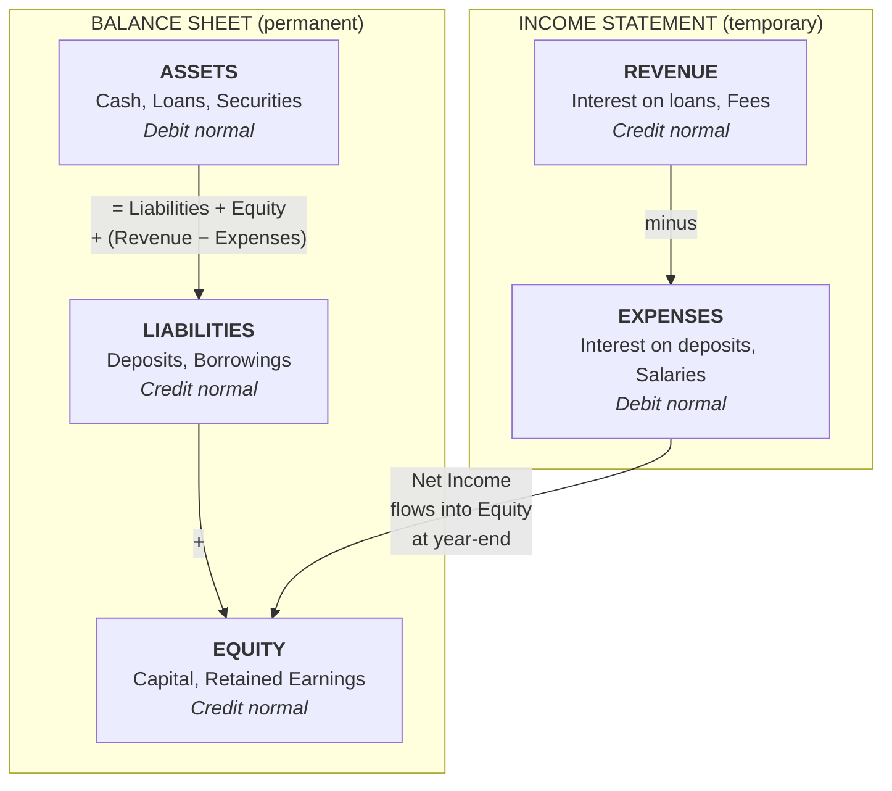

# In-Memory Core Banking System

A simplified but functionally complete Go library modeling the core accounting engine of a bank. Intended as a reference implementation for learning and prototyping — not for production use (which would require persistent storage, distributed transactions, etc.).

## Table of Contents

- [Core Banking Concepts](#core-banking-concepts)
- [Accounting Foundations](#accounting-foundations)
  - [Double-Entry Bookkeeping](#double-entry-bookkeeping)
  - [Chart of Accounts](#chart-of-accounts)
    - [Asset](#asset--things-the-bank-owns-or-is-owed)
    - [Liability](#liability--things-the-bank-owes-to-others)
    - [Equity](#equity--the-owners-residual-interest)
    - [Revenue](#revenue--income-the-bank-earns)
    - [Expense](#expense--costs-the-bank-incurs)
  - [Ledger and Subledger Hierarchy](#ledger-and-subledger-hierarchy)
  - [Amounts and Precision](#amounts-and-precision)
- [Transactions](#transactions)
  - [Booking Date vs. Value Date](#booking-date-vs-value-date)
  - [Balance Types](#balance-types)
  - [Multi-Legged Transactions](#multi-legged-transactions)
  - [Multi-Currency](#multi-currency)
  - [Holds (Authorization / Pending Transactions)](#holds-authorization--pending-transactions)
  - [Idempotency](#idempotency)
  - [Transaction Reversal](#transaction-reversal)
- [Reporting and Compliance](#reporting-and-compliance)
  - [End-of-Day Snapshots](#end-of-day-snapshots)
  - [Audit Trail](#audit-trail)
- [Statements](#statements)
  - [What Appears on a Statement](#what-appears-on-a-statement)
  - [Why Transactions and Balances May Not Reconcile](#why-transactions-and-balances-may-not-reconcile)
- [Usage Example](#usage-example)

## Core Banking Concepts

A core banking system is the backbone of a financial institution. It is the "system of record" for all financial activity — every deposit, withdrawal, transfer, loan disbursement, and fee charge flows through it. The concepts below explain how this system models real-world banking.

## Accounting Foundations

### Double-Entry Bookkeeping

The most fundamental principle in banking is double-entry bookkeeping, invented in 15th century Italy and still the foundation of all modern accounting. The rule is simple:

> Every transaction must have equal debits and credits.

This means money never appears or disappears — it always moves from one account to another. When a customer deposits $100 cash:

- **Debit:** Bank's Cash account (asset increases — the bank has more cash)
- **Credit:** Customer's Deposit account (liability increases — the bank owes the customer more)

When a customer transfers $50 to another customer:

- **Debit:** Sender's Deposit account (liability decreases)
- **Credit:** Receiver's Deposit account (liability increases)

The balanced nature of double-entry provides a built-in error-detection mechanism: if debits don't equal credits, something is wrong.

### Chart of Accounts

The chart of accounts organizes all accounts into five fundamental types, derived from the accounting equation:

```
Assets = Liabilities + Equity + (Revenue - Expenses)
```

The five types split into two groups: three permanent accounts on the **balance sheet** (a snapshot of the bank's financial position at a point in time) and two temporary accounts on the **income statement** (activity over a period). At year-end, net income flows into equity, connecting the two:



Each type has a "normal balance" — the direction that increases it:

| Type | Normal Balance | Description | Examples |
|------|---------------|-------------|----------|
| **Asset** | Debit | Things the bank owns or is owed | Cash, loans to customers, securities, real estate |
| **Liability** | Credit | Things the bank owes to others | Customer deposits, borrowings, bonds payable |
| **Equity** | Credit | Owner's residual interest | Paid-in capital, retained earnings |
| **Revenue** | Credit | Income earned | Interest income, fee income, trading gains |
| **Expense** | Debit | Costs incurred | Interest expense, salaries, rent, provisions |

#### Asset — Things the Bank Owns or Is Owed

An asset is anything of value that the bank controls. The most intuitive example is cash sitting in the vault — that is clearly something the bank owns. But assets also include money that other people owe *to* the bank. When a bank gives a customer a $200,000 mortgage, the bank doesn't lose $200,000 — it *converts* one asset (cash) into another asset (a loan receivable). The customer now owes the bank $200,000 plus interest, and that obligation is valuable.

Common asset accounts in a bank:
- **Cash / reserves** — physical currency and balances held at the central bank
- **Loans to customers** — mortgages, personal loans, credit card balances
- **Securities** — government bonds, corporate bonds, and other investments the bank holds
- **Interbank lending** — short-term loans to other banks (e.g., overnight lending)

Assets have a **debit normal balance**, meaning a debit increases an asset and a credit decreases it. When the bank receives a $500 cash deposit from a customer, its cash (asset) increases by a $500 debit — but as we'll see, the other side of that entry is a liability.

#### Liability — Things the Bank Owes to Others

A liability is an obligation the bank has to pay someone else. The most important liability for a bank is **customer deposits**. When a customer deposits $500 into their checking account, the bank now *owes* that customer $500 on demand. The customer's account balance is, from the bank's perspective, a debt.

This is often the most counterintuitive part: the money in your checking account is the bank's liability, not its asset. The bank has the cash (asset), but it owes that cash back to you (liability).

Common liability accounts in a bank:
- **Customer deposits** — checking accounts, savings accounts, certificates of deposit
- **Borrowings** — money the bank has borrowed from other banks or the central bank
- **Bonds payable** — debt securities the bank has issued to raise capital

Liabilities have a **credit normal balance**. A credit increases a liability and a debit decreases it. When a customer deposits $500, the bank credits the customer's deposit account (liability goes up) and debits its cash account (asset goes up). Both sides increase — the bank has more cash *and* owes more to the customer.

#### Equity — The Owner's Residual Interest

Equity is what's left over after you subtract liabilities from assets. It represents the shareholders' stake in the bank. If a bank has $100M in assets and $92M in liabilities, the equity is $8M.

Equity accounts don't change as frequently as the others. They mainly move when the bank issues new shares, buys back shares, or at year-end when net profit (revenue minus expenses) is rolled into retained earnings.

Common equity accounts:
- **Paid-in capital** — money shareholders invested when buying the bank's stock
- **Retained earnings** — accumulated profits the bank has kept rather than distributing as dividends

Equity has a **credit normal balance**. Profits increase equity (credit), losses decrease it (debit).

#### Revenue — Income the Bank Earns

Revenue accounts track money flowing into the business from its operations. For a bank, the primary source of revenue is interest charged on loans — the bank lends money at a higher rate than it pays on deposits, and the difference (the *net interest margin*) is how banks make most of their money.

Common revenue accounts:
- **Interest income** — interest earned on loans, mortgages, and securities
- **Fee income** — account maintenance fees, ATM fees, wire transfer fees, overdraft fees
- **Trading gains** — profits from buying and selling securities

Revenue has a **credit normal balance**. When a customer pays $50 in monthly interest on a loan, the bank credits interest income (revenue goes up) and debits the customer's loan account (the loan balance — an asset — decreases because the customer has repaid part of it) or debits cash (if the payment comes from outside the bank).

At year-end, revenue accounts are "closed" — their balances are zeroed out and the net profit is transferred into retained earnings (equity).

#### Expense — Costs the Bank Incurs

Expense accounts track the costs of running the bank. Just as revenue increases the owners' stake, expenses decrease it.

Common expense accounts:
- **Interest expense** — interest paid to depositors and bondholders (this is the bank's biggest cost)
- **Salaries and benefits** — compensation for employees
- **Provisions for loan losses** — money set aside in case borrowers default
- **Operating costs** — rent, technology, compliance, legal

Expenses have a **debit normal balance**. When the bank pays $10 in monthly interest to a savings account customer, it debits interest expense (expense goes up) and credits the customer's deposit account (liability goes up — the bank now owes the customer $10 more).

Like revenue, expense accounts are closed at year-end into retained earnings.

### Ledger and Subledger Hierarchy

Accounts are organized into a two-level hierarchy:

```
General Ledger
├── Customer Deposits (subledger)
│   ├── Alice Checking (Liability)
│   ├── Bob Checking (Liability)
│   └── ... 50,000 more accounts
├── Loans (subledger)
│   ├── Loan #12345 (Asset)
│   └── ...
├── Bank Assets (subledger)
│   └── Cash Vault (Asset)
└── Revenue (subledger)
    └── Fee Income (Revenue)
```

- **Ledger:** The top-level book. A bank typically has a General Ledger (GL) that contains all accounts. Large banks may also have separate ledgers for different business units or legal entities.

- **Subledger:** A subdivision of a ledger that groups related accounts. For example, under the General Ledger you might have subledgers for "Customer Deposits", "Loans", "Interbank", "Fee Income", etc. Subledgers allow the GL to show summary totals while the subledger contains the individual account detail.

In practice, the General Ledger might show one line item for "Total Customer Deposits" ($10M), while the Customer Deposits subledger contains 50,000 individual customer accounts that sum to that total.

### Amounts and Precision

All monetary amounts are represented as integer values in the smallest unit of the currency (e.g., cents for USD, pence for GBP, yen for JPY). This is the same approach used by Stripe, most banks, and payment processors.

This avoids floating-point precision issues entirely. For example:

| Display | Internal | Unit |
|---------|----------|------|
| $100.50 USD | 10050 | cents |
| EUR 1,234.56 | 123456 | cents |
| JPY 10,000 | 10000 | yen (no minor units) |

The caller is responsible for knowing the minor unit convention of each currency and converting to/from display format.

## Transactions

### Booking Date vs. Value Date

Every transaction carries two dates:

- **Booking Date:** The date/time when the transaction was recorded in the system. This is the "system date" or "processing date". It determines when the transaction appears in audit trails and system reports.

- **Value Date:** The date when the transaction takes economic effect. This determines when interest starts accruing, when funds become available, and which business day "owns" the transaction. The value date may be in the past (back-dated) or future (forward-dated) relative to the booking date.

#### When Value Date Differs from Booking Date

In many real-world scenarios the two dates can diverge by days or even weeks:

- **Weekend/holiday processing:** A wire transfer received Friday evening is booked immediately (Booking Date: Friday 7:00 PM) but funds are only available on the next business day (Value Date: Monday). Over a long holiday weekend this gap can stretch to 4–5 days.

- **Check deposits:** A customer deposits a check on Monday and the bank records it right away (Booking Date: Monday). However, the check must clear through the interbank settlement network, so the value date might be Wednesday or Thursday depending on the clearing cycle. Until then the funds don't accrue interest and may not be available for withdrawal.

- **Back-dated corrections:** An operations team discovers on March 5 that a corporate payment should have settled on February 28. The correction is booked today (Booking Date: March 5) but given a value date of February 28 so that interest calculations for the intervening days are correct. Without this, the customer would lose several days of interest.

- **Forward-dated standing orders:** A customer schedules a rent payment for the 1st of next month. The bank may book the instruction today (Booking Date: January 20) but assign a value date of February 1, when the money actually moves and interest implications begin.

- **International transfers:** Cross-border payments routed through correspondent banks can take 2–3 business days to settle. The sending bank books the debit immediately, but the receiving bank's credit may carry a value date days later once the nostro/vostro accounts are reconciled.

- **Securities settlement:** A stock trade executed on Monday (trade date T) typically settles on Wednesday (T+2). The cash leg is booked on Monday but value-dated to Wednesday when ownership and funds actually transfer.

Interest is calculated based on value dates, not booking dates. This distinction is critical for accurate financial calculations — using the wrong date can mean customers earn too much or too little interest, and regulatory balance reports would be incorrect.

#### Who Decides the Value Date

The value date is not set by a single actor — it depends on the transaction type:

- **Automated rules** handle the majority of cases. The bank's system assigns the value date based on predefined policies per product and payment channel (e.g., domestic wires get same-day value, checks get T+2, international transfers get T+1 to T+3 depending on the corridor).

- **Payment networks** can dictate it. SWIFT messages for international transfers include a value date field set by the sending bank that the receiving bank is expected to honor. Securities settlement follows market conventions like T+2 that both parties agree to.

- **The customer** influences it for scheduled payments and standing orders — they choose when the payment should take effect, which becomes the value date.

- **Operations staff** set it manually for corrections and adjustments, deciding the appropriate value date based on when the economic event actually occurred or should have occurred.

- **Regulation** constrains all of the above. Laws like the US Expedited Funds Availability Act (Reg CC) set maximum hold periods for check deposits, putting an upper bound on how far the value date can lag behind the booking date.

In practice, most core banking systems have a rules engine upstream of the ledger that determines the value date automatically before posting the transaction.

### Balance Types

A single account carries three distinct balances at any point in time:

- **Value-date balance** (also called the **interest-bearing balance**): The balance computed from transactions whose value date has passed. This is what the bank uses to calculate interest, generate end-of-day snapshots, and produce regulatory reports. It represents the economic reality of the account.

- **Book balance** (also called the **ledger balance**): The balance computed from all posted transactions based on their booking date, regardless of value date. It reflects everything that has been recorded in the system.

- **Available balance**: The book balance minus any active holds. This is what ATMs and point-of-sale terminals check to decide whether a transaction should be approved.

For example, a single account might show all three balances simultaneously:

| Balance | Amount | What drives it |
|---------|--------|----------------|
| Value-date balance | $9,500 | Only transactions whose value date has passed |
| Book balance | $10,000 | All posted transactions |
| Available balance | $9,200 | Book balance minus $800 in active holds |

The value-date balance can be lower than the book balance if a forward-dated transaction has been booked but its value date has not yet arrived. It can be higher if a back-dated correction added economic value to a past date.

### Multi-Legged Transactions

While simple transfers involve two entries (one debit, one credit), real-world transactions often require more legs:

- **Fee split:** A $100 payment might be split into $97 to the merchant and $3 to the fee income account.

- **FX transaction:** Buying EUR 100 for $110 involves debiting a EUR asset account, crediting a USD asset account, and potentially posting the FX margin to a revenue account.

- **Loan disbursement:** Disbursing a $10,000 loan might involve crediting the customer's deposit account, debiting the loan receivable account, and debiting an origination fee from the deposit account with a corresponding credit to fee revenue.

In all cases, the invariant holds: **total debits = total credits per currency**.

### Multi-Currency

Accounts can participate in transactions in any currency. Balances are tracked independently per currency — there is no automatic FX conversion at the ledger level. This means an account can have balances in multiple currencies simultaneously (e.g., $1000 USD, EUR 800, JPY 50000).

This is the native-currency model. If reporting in a base currency is needed (e.g., for consolidated financial statements), that conversion happens at the reporting layer, not in the ledger.

### Holds (Authorization / Pending Transactions)

Holds model the "auth-capture" flow common in card payments and other scenarios where funds must be reserved before a final amount is known:

1. **Authorization:** When a customer swipes their debit card at a gas pump, the bank places a hold (e.g., $100) on the account. The book balance is unchanged, but the available balance drops by $100.

2. **Capture:** When the customer finishes pumping ($45 of gas), the hold is captured for the actual amount. The hold is removed and a real transaction is posted for $45.

3. **Release:** If the transaction is cancelled (e.g., the customer drives away without pumping), the hold is released and the available balance is restored.

The difference between book balance and available balance is significant:

```
Book Balance      = sum of all posted transactions
Available Balance = Book Balance - Active Holds
```

Holds typically have an expiration time. If not captured within that window, they automatically stop affecting the available balance.

#### Holds Are Off-Ledger

Unsettled holds do not exist as ledger entries. The ledger only records posted transactions — actual debits and credits that have settled. A hold is an operational concept tracked separately; it doesn't move money and doesn't appear in the general ledger or trial balance.

A hold only touches the ledger when it is **captured** — at that point a real transaction is posted with proper debits and credits. If the hold is **released**, nothing ever hits the ledger; from an accounting perspective it's as if it never happened.

In a typical core banking architecture, holds are stored separately from the transaction journal. The ledger is only involved when a hold is captured and converted into a real transaction.

### Idempotency

In distributed systems, clients may retry requests due to timeouts or network failures. Without idempotency, a retry could cause the same transaction to be posted twice.

The idempotency key mechanism prevents this:

1. The client generates a unique key (e.g., a UUID) for each logical operation and includes it in the request.
2. If the system receives a request with a key it has already processed, it returns an error instead of creating a duplicate.
3. The client can then look up the original transaction by the key.

### Transaction Reversal

In banking, posted transactions are never deleted. The ledger is an immutable record. To correct an error, a new "reversal" transaction is posted that exactly offsets the original:

- Every debit in the original becomes a credit in the reversal.
- Every credit in the original becomes a debit in the reversal.
- The net effect on all accounts is zero.

The original transaction is marked as "Reversed" for reporting purposes, and the reversal transaction carries a reference to the original.

## Reporting and Compliance

### End-of-Day Snapshots

At the end of each business day, the system captures a snapshot of each account's balance. These snapshots serve multiple purposes:

- **Interest accrual:** Daily interest is calculated on the end-of-day balance. For a savings account earning 4% APR, the daily interest on a $10,000 balance is: $10,000 * 0.04 / 365 = $1.10.

- **Statement generation:** Monthly statements show the balance at the end of each day, transaction activity, and opening/closing balances.

- **Regulatory reporting:** Banks must report their positions to regulators. End-of-day balances are the standard reporting granularity.

- **Performance optimization:** Instead of replaying all transactions from account creation, balance queries can start from the most recent snapshot and only replay subsequent transactions.

### Audit Trail

The audit trail is an immutable, append-only log of every mutation in the system. Nothing is ever deleted from the audit trail. Every account creation, transaction posting, hold creation, hold release, reversal, and snapshot is recorded with:

- A unique event ID
- A timestamp
- The event type
- The entity affected
- The full event payload

The audit trail provides:

- Regulatory compliance (banks must maintain complete records)
- Forensic investigation capability
- System debugging and incident response
- Independent balance verification (replay events to recompute balances)

## Statements

A bank statement is a periodic report (typically monthly) summarizing all activity and balances on a customer's account. Statements rely on both the booking date and value date of each transaction.

### What Appears on a Statement

- **Transaction listing:** All transactions with a **booking date** within the statement period, ordered chronologically. This is what the customer recognizes as their activity — "I made this payment on Feb 3rd, I got paid on Feb 15th."

- **Opening and closing balances:** Calculated using the **value date**. The opening balance is the end-of-day value-date balance from the last day of the prior period. The closing balance reflects all transactions whose value date falls within the statement period.

- **Daily balances:** The value-date balance at the end of each day, used for interest accrual and regulatory purposes.

### Why Transactions and Balances May Not Reconcile

Because booking dates and value dates can differ, the listed transactions may not perfectly "add up" to the balance change shown on the statement:

- A transaction **booked on February 25** with a **value date of March 1** would appear in February's transaction listing but would not affect February's closing balance.

- A transaction **booked on January 31** with a **value date of February 1** would not appear in February's transaction listing but would affect February's opening balance.

Most retail bank statements show both dates per transaction when they differ, so the customer can see why the figures may not seem to reconcile at first glance.

End-of-day snapshots use value date for this reason — they are the foundation for the balance figures that appear on statements and for interest accrual.

## Usage Example

```go
svc := ledger.NewService()

// Set up the chart of accounts
gl, _ := svc.CreateLedger("General Ledger")
deposits, _ := svc.CreateSubledger(gl.ID, "Customer Deposits")
revenue, _ := svc.CreateSubledger(gl.ID, "Revenue")

// Create accounts
alice, _ := svc.CreateAccount(deposits.ID, "Alice Checking", ledger.Liability)
bob, _ := svc.CreateAccount(deposits.ID, "Bob Checking", ledger.Liability)
fees, _ := svc.CreateAccount(revenue.ID, "Transfer Fees", ledger.Revenue)

// Transfer $100 from Alice to Bob with a $2 fee
svc.PostTransaction(ledger.PostTransactionRequest{
    IdempotencyKey: "transfer-001",
    Description:    "Transfer from Alice to Bob",
    Entries: []ledger.Entry{
        {AccountID: alice.ID, Amount: 10200, Currency: "USD", Direction: ledger.Debit},
        {AccountID: bob.ID, Amount: 10000, Currency: "USD", Direction: ledger.Credit},
        {AccountID: fees.ID, Amount: 200, Currency: "USD", Direction: ledger.Credit},
    },
})
```

Note that customer deposit accounts are **Liability** accounts (the bank owes the customer). Debiting Alice's Liability account decreases it (she has less money), and crediting Bob's increases it (he has more money).
